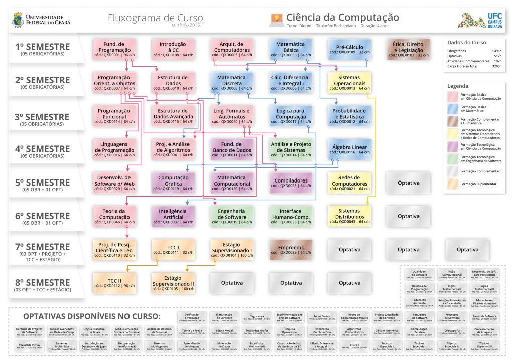

# How to contribute
You can contribute in a lot of ways, it can be [coding](#how-to-contribute-with-coding), [reporting bugs](#report-a-bug), [requesting new features](#how-to-request-a-new-feature), [creating a new class or course](#how-to-create-a-course) or even using the project and telling us what did you think about it.

## How to report a bug

-    Access https://github.com/semester-orgarnizer-UFC/semester-organizer/issues

-    Click on New Issue

-    Put a detailed title and on the description, if you don't mind, put as much information as possible: expected behavior, screenshots.

> If you want something more informal, please contact me in any social media, i'd appreaciate it.

## How to request a new feature

-    Access https://github.com/semester-orgarnizer-UFC/semester-organizer/issues

-    Do the same procedure as the [bug report](#how-to-report-a-bug), but instead of bug, put a feature, let's say: I would like to login with google instead of creating my own account 

> If you want something more informal, please contact me in any social media, i'd appreaciate it.


## How to contribute with coding

-    Clone the repository

-    `git checkout staging`

-    Check if there's one issue that you could work on

  > If there's no issue, feel free to create one
  
-    Grab the issue number, let's say (42) and then, create a branch called: `fix/#42`.

-    `git pull origin main`

> Solve the possible conflicts

-    Commit your changes and pushes your branch

> Don't forget to follow the good practices of a commit: (#$ISSUE_NUMBER - $TAG: $MESSAGE COMMIT) -> #142 - fix: remove the entity User

## How to create a course

-    Access https://cc.quixada.ufc.br/estrutura-curricular/fluxograma-de-disciplinas/
-    Check the classes and try to replicate the model using the following JSON structure: 



> Try to replicate this image in the json

```json
{
  "id": "QXD_CC",
  "name": "Ciência da computação",
  "shortName": "CC",
  "mandatoryClasses": [
    {
        "id": "QXD0001", // The cod of the class 
        "name": "Fundamentos de programação", // The name
        "hours": 96, // How many hours if this class
        "semester": 1 // Which semester is this class
    },
    {
        "id": "QXD0010",
        "name": "Estrutura de dados",
        "hours": 64,
        "semester": 2,
        "preRequisite": {
            "ref": "Classes", // The DB ref, please always put classes
            "id": "QXD0001" // The id of the preRequisite class, in this case is: Fundamentos de programação
        }
    }
  ]
}
```

-    Place the json in the file: `backend/src/main/resources/courses/`
> We have only the `cc.json` until now, but feel free to create any other.
-    Commit your changes and push
